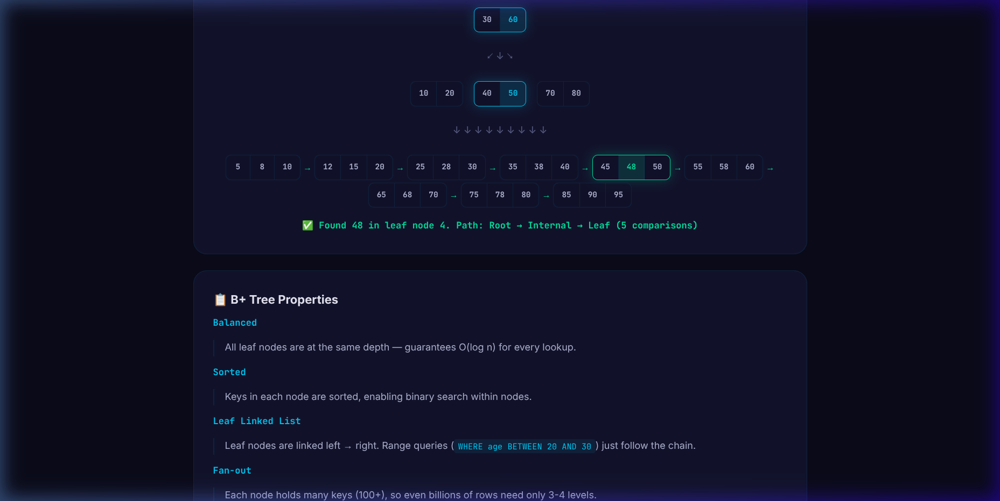

# 🗄️ Database Indexing — Interactive Visualizer

An interactive, single-page web app that teaches **database indexing** through live animations and visualizations. Click buttons, toggle modes, and watch how indexes work under the hood.

> Just open `index.html` in a browser — no build step required.

## ✨ Features

- 🎨 **Premium dark-mode UI** with glassmorphism
- ⚡ **10 interactive sections** covering all major indexing concepts
- 🎬 **Animated demos** — see B-Tree traversal, full scan vs index scan, write amplification
- 📱 **Responsive** — works on desktop and tablet
- 🧠 **Interview-ready** — covers the most common indexing questions

## 📸 Screenshots

### Hero & Full Scan vs Index Scan


### B+ Tree Search (value 48)



### Composite Index — Leftmost Prefix Rule


### EXPLAIN Query Plan


### Selectivity & Cardinality


### Write Penalty (5 indexes)


---

## 📚 Interactive Sections

| #  | Section | What You Can Do |
| -- | ------- | --------------- |
| 01 | **Full Scan vs Index Scan** | Animated 20-row table: Full Scan (row-by-row) vs Index Lookup (instant) |
| 02 | **B-Tree / B+ Tree** | Type a value → watch search path highlight through 3-level tree |
| 03 | **Hash Index** | Hash function → bucket animation, Hash vs B-Tree comparison |
| 04 | **Clustered vs Non-Clustered** | Toggle to see physical vs logical organization, heap lookup |
| 05 | **Composite Index** | 6 different WHERE clauses test the leftmost prefix rule |
| 06 | **Covering Index** | Regular Index (table lookup) vs Covering Index (index-only scan) |
| 07 | **EXPLAIN / Query Plan** | 4 preset queries → animated Seq/Index/IndexOnly/Bitmap scan plans |
| 08 | **Selectivity & Cardinality** | Bar chart: email (perfect) vs gender (terrible) index candidates |
| 09 | **Write Penalty** | INSERT with 0/3/5 indexes — see write amplification (up to 6x) |
| 10 | **When NOT to Index** | Interactive toggles → dynamic recommendation (GO / MAYBE / SKIP) |

---

## 🛠️ Technology

| Technology | Usage |
| ---------- | ----- |
| HTML5 | Semantic structure |
| CSS3 | Dark-mode design system, glassmorphism, animations |
| JavaScript (ES6+) | Interactive logic, DOM manipulation, animation timers |

---

## 🚀 Getting Started

```bash
git clone <repo-url>
cd projects/db-indexing-visualizer
open index.html   # or just double-click
```

> No dependencies. No build step. Works best in Chrome/Edge.

## 📁 Project Structure

```text
db-indexing-visualizer/
├── index.html      # 10 sections with semantic HTML
├── index.css       # 330+ lines of dark-mode styles
├── index.js        # 480+ lines of interactive logic
├── screenshots/    # Screenshots and demo recordings
└── README.md       # This file
```

## 🎯 Use Cases

- **Interview Prep** — covers top database indexing questions
- **Learning** — visual explanations beat textbook definitions
- **Teaching** — show students how indexes work in real-time
