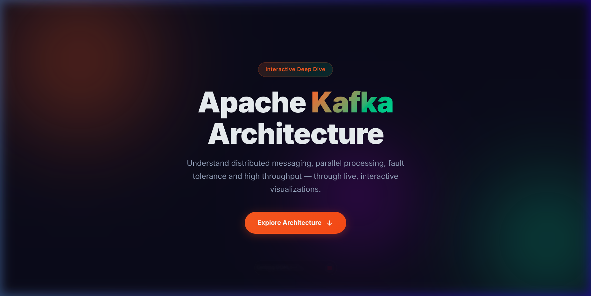
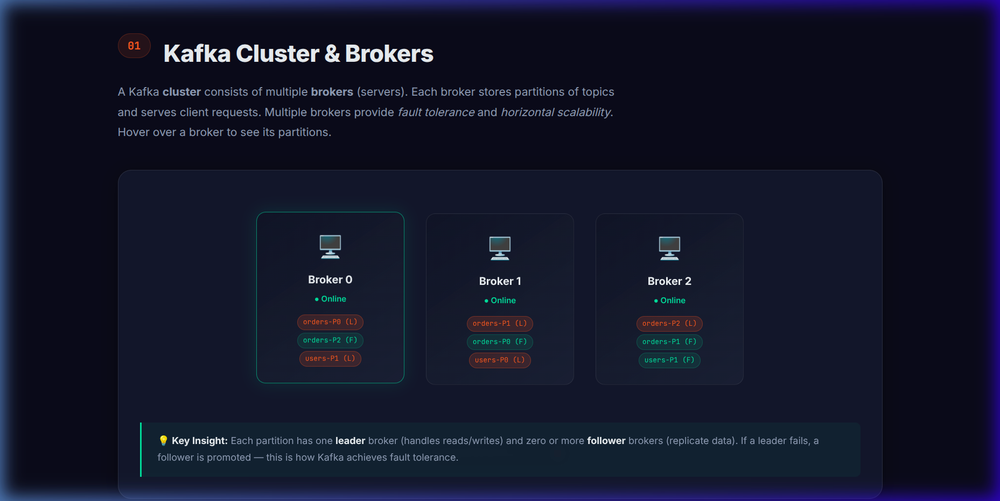
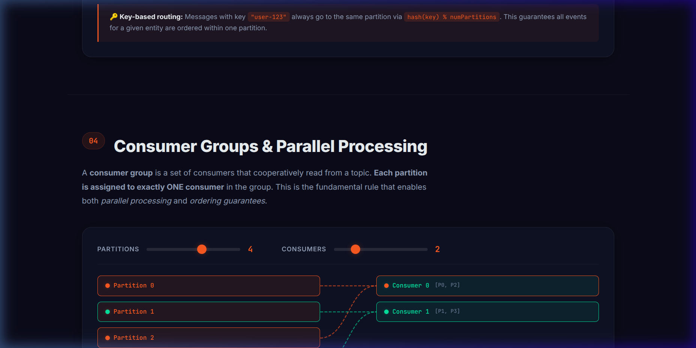
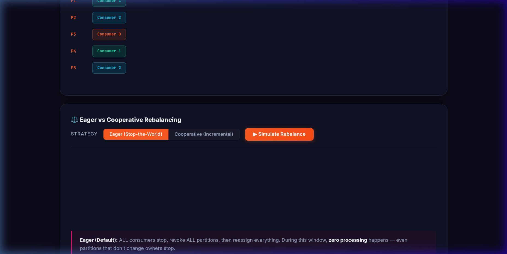
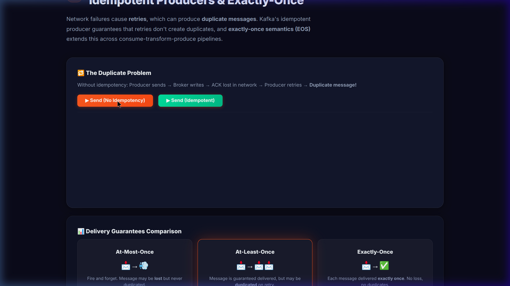
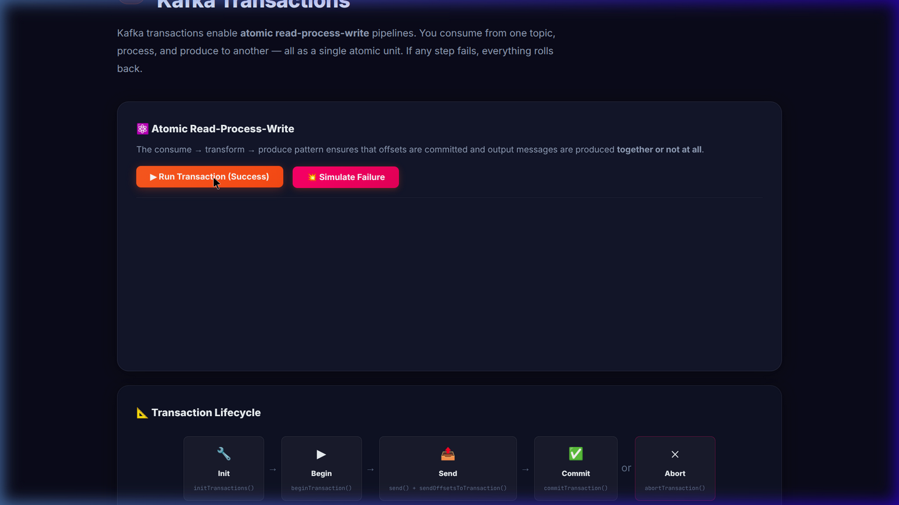
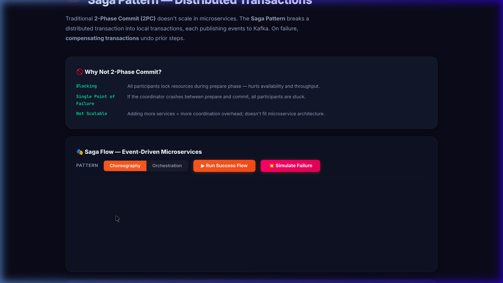
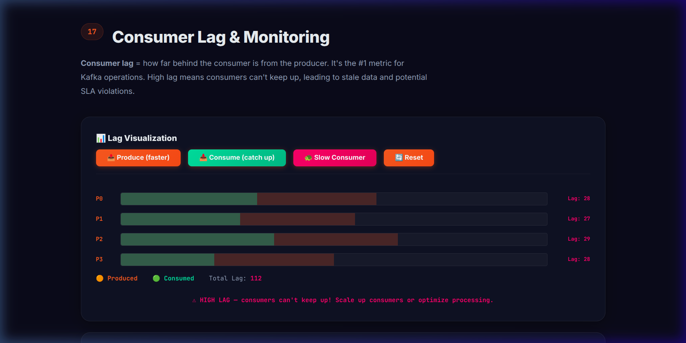

# 🚀 Apache Kafka Architecture — Interactive Visualizer

An interactive, single-page web application that teaches Apache Kafka architecture through **live visualizations and animations**. Built with vanilla HTML, CSS, and JavaScript — no frameworks needed.

> **[▶ Open the Visualizer](./index.html)** — just open `index.html` in your browser!

---

## ✨ Features

- 🎨 **Premium dark-mode UI** with glassmorphism and Kafka brand colors
- ⚡ **24 interactive sections** covering core and advanced Kafka concepts
- 🎬 **Animated demos** — click buttons to see Kafka concepts come alive
- 📱 **Responsive design** — works on desktop and tablet
- 🧠 **Interview-ready** — covers common Kafka questions with visual explanations
- 🚫 **Zero dependencies** — plain HTML/CSS/JS, no build step

---

## 📸 Screenshots

### Hero & Cluster





### Consumer Groups (Interactive)



### High Throughput — 6 Interactive Visualizations


### Consumer Group Rebalancing



### Idempotent Producers & Exactly-Once



### Kafka Transactions



### Saga Pattern — Distributed Transactions



### Consumer Offsets & Commit Strategies


### Log Compaction


### Consumer Lag & Monitoring



### Event Sourcing & CQRS


### Kafka Security


---

## 🎬 Demo Recording


---

## 📚 Interactive Sections

| #  | Section | What You Can Do |
| -- | ------- | --------------- |
| 01 | **Cluster & Brokers** | View 3 broker nodes with leader/follower partition chips |
| 02 | **Topics & Partitions** | Drag slider to see 1–8 partitions |
| 03 | **Producers & Message Flow** | Toggle Round-Robin vs Key-Based, Send/Burst buttons |
| 04 | **Consumer Groups** | Dual sliders, SVG arrows, idle detection, throughput metrics |
| 05 | **Message Ordering** | See per-partition vs global ordering proof |
| 06 | **Replication & Fault Tolerance** | Kill Leader / Restore, acks=0/1/all simulation |
| 07 | **High Throughput** | 6 interactive vizs: Sequential I/O, Zero-Copy, Batching, Page Cache, Partitioning, Pull vs Push |
| 09 | **Consumer Group Rebalancing** | Add/Remove/Crash consumers, Eager vs Cooperative timeline |
| 10 | **Idempotent Producers** | Retry animation with/without idempotency, delivery guarantee cards |
| 11 | **Kafka Transactions** | Atomic pipeline success/failure, transaction state machine |
| 12 | **Saga Pattern** | Choreography vs Orchestration, compensation on failure |
| 13 | **Consumer Offsets** | Consume Next / Commit / Crash consumer offset pointer |
| 14 | **Log Compaction** | Run Compaction to see before/after key dedup + tombstones |
| 15 | **Schema Registry** | BACKWARD / FORWARD / FULL compatibility, add/remove field |
| 16 | **Dead Letter Queue** | Good message vs Poison Pill with 3x retry → DLQ routing |
| 17 | **Consumer Lag** | Produce / Consume / Slow Consumer bar chart with lag alerts |
| 19 | **Kafka Streams** | KStream (append) vs KTable (upsert), state store visualization |
| 20 | **Kafka Connect** | Source (DB→Kafka) / Sink (Kafka→ES) pipeline animation |
| 21 | **Partitioning Strategies** | Round-Robin vs Key Hash vs Hot Key demo |
| 22 | **Event Sourcing & CQRS** | Append-only event log + materialized view + replay |
| 23 | **Kafka Security** | 5-layer security toggle (SSL, SASL, ACLs, Inter-Broker, At-Rest) |
| 24 | **Kafka vs Traditional MQ** | Side-by-side comparison table |

---

## 🛠️ Tech Stack

| Technology | Usage |
| ---------- | ----- |
| HTML5 | Semantic structure, sections |
| CSS3 | Dark-mode design system, glassmorphism, animations |
| JavaScript (ES6+) | Interactive logic, DOM manipulation, timers |
| Google Fonts | Inter (sans-serif), JetBrains Mono (monospace) |

---

## 🚀 Getting Started

```bash
# Clone and open
git clone <repo-url>
cd projects/kafka-visualizer
open index.html  # or double-click the file
```

No build step. No `npm install`. Just open in a browser.

> Works best in Chrome/Edge. Firefox and Safari also supported.

---

## 📁 Project Structure


```
kafka-visualizer/
├── index.html      # All 24 sections with semantic HTML
├── index.css       # 2200+ lines of dark-mode responsive styles
├── index.js        # 2300+ lines of interactive animation logic
├── screenshots/    # Screenshots and demo recordings
└── README.md       # This file
```

---

## 🎯 Use Cases

- **Interview Preparation** — Visual explanations of common Kafka architecture questions
- **Learning Kafka** — Interactive demos make abstract concepts concrete
- **Teaching** — Use as a live demo in presentations or workshops
- **Reference** — Quick visual lookup for Kafka configs and patterns

---

## 📄 License

Built for learning — Apache Kafka Architecture Visualizer
