```mermaid
sequenceDiagram
    participant OS as Order Service
    participant K as Kafka
    participant IS as Inventory Service
    participant PS as Payment Service
    participant NS as Notification Service

    OS->>K: 📤 OrderCreated
    K->>IS: 📥 OrderCreated
    IS->>IS: Reserve inventory
    IS->>K: 📤 InventoryReserved

    K->>PS: 📥 InventoryReserved
    PS->>PS: Charge payment
    PS->>K: 📤 PaymentCompleted

    K->>NS: 📥 PaymentCompleted
    NS->>NS: Send confirmation
    K->>OS: 📥 PaymentCompleted
    OS->>OS: Mark order CONFIRMED ✅
```

```mermaid
sequenceDiagram
    participant OS as Order Service
    participant K as Kafka
    participant IS as Inventory Service
    participant PS as Payment Service

    OS->>K: 📤 OrderCreated
    K->>IS: 📥 OrderCreated
    IS->>IS: Reserve inventory ✅
    IS->>K: 📤 InventoryReserved

    K->>PS: 📥 InventoryReserved
    PS->>PS: Charge payment ❌ FAILS
    PS->>K: 📤 PaymentFailed

    K->>IS: 📥 PaymentFailed
    IS->>IS: 🔄 Release inventory (compensate)

    K->>OS: 📥 PaymentFailed
    OS->>OS: 🔄 Cancel order (compensate)
```

```mermaid
sequenceDiagram
    participant O as Saga Orchestrator
    participant OS as Order Service
    participant IS as Inventory Service
    participant PS as Payment Service
    participant NS as Notification Service

    Note over O: Step 1
    O->>OS: CreateOrder command
    OS-->>O: OrderCreated ✅

    Note over O: Step 2
    O->>IS: ReserveInventory command
    IS-->>O: InventoryReserved ✅

    Note over O: Step 3
    O->>PS: ProcessPayment command
    PS-->>O: PaymentCompleted ✅

    Note over O: Step 4
    O->>NS: SendNotification command
    NS-->>O: NotificationSent ✅

    Note over O: Saga COMPLETED ✅
```

# 🔥 Distributed Transactions, Saga Patterns & Spring Boot @Transactional

> A comprehensive, interview-ready guide covering distributed consistency, Kafka, Saga choreography & orchestration, and Spring Boot transaction management.

---

## 📖 Table of Contents

### Part A — Distributed Systems Fundamentals

1. [Why Distributed Transactions?](#-part-a--why-distributed-transactions)
2. [ACID vs BASE — The Fundamental Tradeoff](#acid-vs-base--the-fundamental-tradeoff)
3. [Two-Phase Commit (2PC) — The Classic Approach](#two-phase-commit-2pc--the-classic-approach)

### Part B — Apache Kafka Deep Dive

4. [Kafka as a Distributed Commit Log](#-part-b--kafka-as-a-distributed-commit-log)
5. [Kafka Transactional Producer (Exactly-Once Semantics)](#kafka-transactional-producer-exactly-once-semantics)
6. [How Exactly-Once Actually Works](#how-exactly-once-actually-works--three-pillars)
7. [The Outbox Pattern — Solving the Dual-Write Problem](#the-outbox-pattern--solving-the-dual-write-problem)

### Part C — Saga Patterns

8. [What Is a Saga?](#-part-c--what-is-a-saga)
9. [Compensating Transactions](#compensating-transactions)
10. [Saga — Choreography (Event-Driven)](#saga--choreography-event-driven)
11. [Saga — Orchestration (Command-Driven)](#saga--orchestration-command-driven)
12. [Choreography vs Orchestration — When to Use Which](#choreography-vs-orchestration--when-to-use-which)

### Part D — Spring Boot @Transactional

13. [How @Transactional Works Internally](#-part-d--how-transactional-works-internally)
14. [Basic Usage & Rollback Configuration](#basic-usage--rollback-configuration)
15. [Propagation Levels (All 7)](#propagation-levels-all-7)
16. [Isolation Levels](#isolation-levels)
17. [@Transactional Gotchas & Best Practices](#transactional-gotchas--best-practices)

### Part E — Putting It All Together

18. [Real-World Architecture — E-Commerce Order Flow](#-part-e--real-world-e-commerce-order-flow)
19. [Interview Quick Reference & Cheat Sheet](#interview-quick-reference--cheat-sheet)

---
---

# 🟢 Part A — Why Distributed Transactions?

In a **monolith**, a single database transaction wraps all operations — simple and reliable:

```java
@Transactional
public void placeOrder() {
    orderRepo.save(order);
    paymentRepo.charge(payment);
    inventoryRepo.reserve(items);
    // All succeed or all rollback ✅
}
```

In **microservices**, each service owns its **own database**. A single ACID transaction **cannot** span multiple services.

```mermaid
graph LR
    subgraph "Monolith — Single DB Transaction ✅"
        A[Order] --> B[Payment] --> C[Inventory]
        D[(Single DB)]
        A --> D
        B --> D
        C --> D
    end
```

```mermaid
graph LR
    subgraph "Microservices — Separate DBs ❌ No single TX"
        O[Order Service] --> ODB[(Order DB)]
        P[Payment Service] --> PDB[(Payment DB)]
        I[Inventory Service] --> IDB[(Inventory DB)]
    end
```





> **The Core Problem**: If Payment succeeds but Inventory fails, how do we rollback Payment?

**Available Solutions**: 2PC (avoid in microservices), **Saga Pattern** (preferred), Outbox Pattern, Event Sourcing.

---

## ACID vs BASE — The Fundamental Tradeoff

In a monolith, the database gives us **ACID** guarantees:

| Property | Meaning |
|----------|---------|
| **Atomicity** | All operations succeed or all fail — no partial state |
| **Consistency** | DB moves from one valid state to another |
| **Isolation** | Concurrent transactions don't interfere |
| **Durability** | Once committed, data survives crashes |

In distributed systems, the **CAP Theorem** says you can only guarantee **two out of three**: Consistency, Availability, and Partition Tolerance. Since network partitions are unavoidable, the real choice is:

- **CP** — Strong consistency; may reject requests during partitions
- **AP** — Always available; eventually consistent

Most microservice architectures choose **AP** and embrace the **BASE** model:

| Property | Meaning |
|----------|---------|
| **Basically Available** | System always responds (even with stale data) |
| **Soft State** | State may change over time due to async propagation |
| **Eventually Consistent** | All replicas converge to the same state over time |


> **Key Insight**: Distributed transactions don't give you ACID. Instead, design for **eventual consistency** using Saga, Outbox, and Idempotent Consumers. The question isn't *"how to get ACID across services"* — it's *"how to safely handle partial failures."*

---

## Two-Phase Commit (2PC) — The Classic Approach

A central **Coordinator** asks all participants to prepare, then instructs them to commit or abort:


### Why 2PC Is Avoided in Microservices

| Problem | Impact |
|---------|--------|
| **Blocking** | Resources locked until all participants vote |
| **Single point of failure** | Coordinator crash = entire system stuck |
| **Poor scalability** | Not suited for high-throughput workloads |
| **Tight coupling** | All participants must be available simultaneously |

> **Rule of Thumb**: In microservices, prefer **eventual consistency** (Saga) over **strong consistency** (2PC).

---
---

# 🔵 Part B — Kafka as a Distributed Commit Log

Kafka is **not** just a message queue — it is a **distributed commit log**. This distinction is critical for understanding its role in distributed transactions.

| Feature | Traditional Queue (RabbitMQ / SQS) | Apache Kafka |
|---------|--------------------------------------|--------------|
| **Storage** | Messages deleted after consumption | Messages retained (configurable retention) |
| **Replay** | Not possible | Consumers can re-read from any offset |
| **Ordering** | No global ordering guarantee | Ordered within a partition |
| **Consumer Model** | Push-based | Pull-based (consumer controls pace) |
| **Throughput** | Moderate | Extremely high (millions/sec) |
| **Delivery Semantics** | At-most-once or at-least-once | Exactly-once (with transactions) |

### Why Kafka Fits Distributed Transactions

1. **Durability** — Messages replicated across brokers; survives broker failures
2. **Ordering** — Within a partition, events arrive in exact production order (critical for saga steps)
3. **Replayability** — A crashed consumer can re-consume from its last committed offset
4. **Exactly-once semantics** — Kafka's transactional API enables atomic writes to multiple topics/partitions
5. **Consumer groups** — Multiple service instances share the load; Kafka guarantees each partition is consumed by exactly one instance in a group

### Kafka as the Event Backbone


---

## Kafka Transactional Producer (Exactly-Once Semantics)

Kafka supports **exactly-once processing** via transactional producers:

```java
@Configuration
public class KafkaProducerConfig {

    @Bean
    public ProducerFactory<String, String> producerFactory() {
        Map<String, Object> props = new HashMap<>();
        props.put(ProducerConfig.BOOTSTRAP_SERVERS_CONFIG, "localhost:9092");
        props.put(ProducerConfig.ENABLE_IDEMPOTENCE_CONFIG, true);          // ✅ Idempotent
        props.put(ProducerConfig.TRANSACTIONAL_ID_CONFIG, "order-tx-id");   // ✅ Transactional
        props.put(ProducerConfig.ACKS_CONFIG, "all");                       // ✅ All replicas
        return new DefaultKafkaProducerFactory<>(props);
    }

    @Bean
    public KafkaTemplate<String, String> kafkaTemplate() {
        return new KafkaTemplate<>(producerFactory());
    }
}
```

```java
@Service
public class OrderService {

    @Autowired
    private KafkaTemplate<String, String> kafkaTemplate;

    public void placeOrder(Order order) {
        kafkaTemplate.executeInTransaction(ops -> {
            // Both messages sent atomically — either both or neither
            ops.send("order-events", "OrderCreated:" + order.getId());
            ops.send("audit-log", "Order placed: " + order.getId());
            return true;
        });
    }
}
```

### Transaction Flow


---

## How Exactly-Once Actually Works — Three Pillars

### Pillar 1 — Idempotent Producer (`enable.idempotence=true`)

- Each producer gets a **Producer ID (PID)**, and each message gets a **sequence number**.
- The broker deduplicates using the tuple `(PID, partition, sequence)` — retried messages are silently ignored.
- Prevents duplicates within a **single producer session**.

### Pillar 2 — Transactional Producer (`transactional.id`)

- Extends idempotency across **multiple partitions and producer sessions**.
- A **Transaction Coordinator** (a special Kafka broker) tracks state in an internal `__transaction_state` topic.
- On `commitTransaction()`, the coordinator writes a **COMMIT marker** to all involved partitions atomically.
- Consumers with `isolation.level=read_committed` only see messages from **committed** transactions.

### Pillar 3 — Consumer Offset Commit within Transaction

- A consumer can **commit its read offsets as part of the producer's transaction** — the key to exactly-once in stream processing.
- Pattern: **Read → Process → Produce + Commit offset** — all in one atomic transaction.


> **Interview Tip**: "Exactly-once" in Kafka means exactly-once **within the Kafka ecosystem**. For end-to-end exactly-once involving external systems (databases, APIs), you need the **Outbox Pattern** and **idempotent consumers**.

---

## The Outbox Pattern — Solving the Dual-Write Problem

### The Problem

You **cannot** atomically write to two different systems (database + Kafka). Consider this code:

```java
@Transactional
public void placeOrder(Order order) {
    orderRepo.save(order);                    // Step 1: Write to DB ✅
    kafkaTemplate.send("orders", event);      // Step 2: Write to Kafka
    // What if the app crashes BETWEEN step 1 and step 2?
    // DB has the order, but Kafka never got the event!
    // Or: Kafka send succeeds but the DB TX rolls back?
}
```

### The Solution

Write everything to **one system** (the database) in a single ACID transaction, then use **Change Data Capture (CDC)** to propagate events to Kafka:

```mermaid
sequenceDiagram
    participant OS as Order Service
    participant DB as Order DB
    participant CDC as Debezium / CDC
    participant K as Kafka

    OS->>DB: BEGIN TX
    OS->>DB: INSERT order
    OS->>DB: INSERT outbox_event
    OS->>DB: COMMIT TX
    Note over DB: Both writes in same ACID TX ✅
    CDC->>DB: Poll outbox table
    CDC->>K: Publish event
    CDC->>DB: Mark event as published
```



```java
// Outbox table entity
@Entity
@Table(name = "outbox_events")
public class OutboxEvent {
    @Id
    private UUID id;
    private String aggregateType;   // "Order"
    private String aggregateId;     // orderId
    private String eventType;       // "ORDER_CREATED"
    private String payload;         // JSON
    private LocalDateTime createdAt;
    private boolean published;
}

// Usage in service — single DB transaction
@Transactional
public void placeOrder(Order order) {
    orderRepository.save(order);
    outboxRepository.save(new OutboxEvent(
        "Order", order.getId(), "ORDER_CREATED", toJson(order)
    ));
    // Debezium / CDC picks up the outbox event → publishes to Kafka
}
```

---
---

# 🟣 Part C — What Is a Saga?

The Saga pattern (Hector Garcia-Molina, 1987) breaks a **long-lived transaction (LLT)** into a sequence of **short-lived local transactions**, each operating on a single service's database.

**Core Idea**: Instead of one big ACID transaction spanning multiple services, execute a series of **local ACID transactions** with **compensating actions** to undo work if any step fails.


---

## Compensating Transactions

A **compensating transaction** is NOT simply an "undo." It is a **semantic reverse** of the original action:

| Forward Action | Compensating Action | Why It's Not a Simple Undo |
|----------------|---------------------|---------------------------|
| Create Order (status=PENDING) | Cancel Order (status=CANCELLED) | Can't delete — audit trail may exist |
| Reserve Inventory (qty − 5) | Release Inventory (qty + 5) | Must handle race conditions |
| Charge Payment ($100) | Refund Payment ($100) | Refund is a separate financial transaction |
| Send Confirmation Email | Send Cancellation Email | Can't "unsend" an email |

### Rules for Compensating Transactions

1. **Idempotent** — Running them twice must have the same effect as running once.
2. **Retryable** — If compensation fails, it must be retried until it succeeds.
3. **Never fail permanently** — Design them to always eventually succeed.
4. **Reverse order** — Compensate in the **reverse order** of forward actions.

### Two Implementation Approaches

| | Choreography | Orchestration |
|---|---|---|
| **Control** | Decentralized | Centralized |
| **Communication** | Events | Commands |
| **Coupling** | Loose | Medium |
| **Complexity** | Grows with services | Manageable |
| **Best for** | Simple flows (2–4 steps) | Complex flows (5+ steps) |

---

## Saga — Choreography (Event-Driven)

In choreography, there is **no central brain**. Each service acts independently based on the events it observes — like dancers performing without a conductor. Each service knows:

1. Which events to **listen** for
2. What **local action** to perform
3. Which event to **publish** after success or failure

> **Think of it like a relay race**: Each runner (service) grabs the baton (event), runs their leg (local TX), and passes it to the next runner. If someone drops the baton, they signal backward.

### Happy Path



### Failure & Compensation



### Spring Boot Implementation

```java
// ====== ORDER SERVICE ======
@Service
public class OrderService {

    @Autowired private KafkaTemplate<String, OrderEvent> kafkaTemplate;
    @Autowired private OrderRepository orderRepository;

    @Transactional
    public Order createOrder(OrderRequest request) {
        Order order = Order.builder()
            .status(OrderStatus.PENDING)
            .items(request.getItems())
            .totalAmount(request.getTotalAmount())
            .build();
        order = orderRepository.save(order);
        
        kafkaTemplate.send("order-events", new OrderCreatedEvent(
            order.getId(), order.getItems(), order.getTotalAmount()
        ));
        return order;
    }

    @KafkaListener(topics = "payment-events", groupId = "order-service")
    public void handlePaymentEvent(PaymentEvent event) {
        if (event.getStatus() == PaymentStatus.COMPLETED) {
            orderRepository.updateStatus(event.getOrderId(), OrderStatus.CONFIRMED);
        } else if (event.getStatus() == PaymentStatus.FAILED) {
            orderRepository.updateStatus(event.getOrderId(), OrderStatus.CANCELLED);
        }
    }
}
```

```java
// ====== INVENTORY SERVICE ======
@Service
public class InventoryService {

    @Autowired private KafkaTemplate<String, InventoryEvent> kafkaTemplate;
    @Autowired private InventoryRepository inventoryRepository;

    @KafkaListener(topics = "order-events", groupId = "inventory-service")
    @Transactional
    public void handleOrderCreated(OrderCreatedEvent event) {
        try {
            inventoryRepository.reserveItems(event.getItems());
            kafkaTemplate.send("inventory-events", new InventoryReservedEvent(
                event.getOrderId(), event.getItems()
            ));
        } catch (InsufficientStockException e) {
            kafkaTemplate.send("inventory-events", new InventoryFailedEvent(
                event.getOrderId(), e.getMessage()
            ));
        }
    }

    @KafkaListener(topics = "payment-events", groupId = "inventory-service")
    @Transactional
    public void handlePaymentFailed(PaymentFailedEvent event) {
        inventoryRepository.releaseItems(event.getOrderId()); // 🔄 Compensate
    }
}
```

```java
// ====== PAYMENT SERVICE ======
@Service
public class PaymentService {

    @Autowired private KafkaTemplate<String, PaymentEvent> kafkaTemplate;
    @Autowired private PaymentRepository paymentRepository;

    @KafkaListener(topics = "inventory-events", groupId = "payment-service")
    @Transactional
    public void handleInventoryReserved(InventoryReservedEvent event) {
        try {
            paymentRepository.charge(event.getOrderId(), event.getAmount());
            kafkaTemplate.send("payment-events", new PaymentCompletedEvent(
                event.getOrderId()
            ));
        } catch (PaymentException e) {
            kafkaTemplate.send("payment-events", new PaymentFailedEvent(
                event.getOrderId(), e.getMessage()
            ));
        }
    }
}
```

### Choreography — Pros & Cons

| ✅ Pros | ❌ Cons |
|---------|---------|
| Loose coupling between services | Hard to track the overall flow |
| Simple for few services | Cyclic dependencies possible |
| Easy to add new consumers | No single place to see the full saga |
| High autonomy per service | Debugging is harder |

---

## Saga — Orchestration (Command-Driven)

In orchestration, a **central Saga Orchestrator** acts as the brain — like an orchestra conductor telling each musician when and what to play. The musicians don't communicate with each other directly.

The orchestrator:

1. Maintains a **state machine** tracking the current saga step
2. Sends **commands** (imperative: *"do this"*) to services — not events
3. Receives **replies** (success/failure) from services
4. Decides the **next step** or triggers **compensation** based on replies
5. Persists its state to a database for crash recovery

> **Commands vs Events** — An important distinction:
> - **Event**: *"Something happened"* (past tense) — `OrderCreated`, `PaymentCompleted`
> - **Command**: *"Do something"* (imperative) — `ReserveInventory`, `ProcessPayment`

### Happy Path



### Failure & Compensation



```mermaid
sequenceDiagram
    participant O as Saga Orchestrator
    participant OS as Order Service
    participant IS as Inventory Service
    participant PS as Payment Service

    Note over O: Step 1
    O->>OS: CreateOrder
    OS-->>O: OrderCreated ✅

    Note over O: Step 2
    O->>IS: ReserveInventory
    IS-->>O: InventoryReserved ✅

    Note over O: Step 3
    O->>PS: ProcessPayment
    PS-->>O: PaymentFailed ❌

    Note over O: 🔄 COMPENSATING...
    O->>IS: ReleaseInventory (compensate)
    IS-->>O: InventoryReleased ✅

    O->>OS: CancelOrder (compensate)
    OS-->>O: OrderCancelled ✅

    Note over O: Saga FAILED — All compensated
```

### State Machine

```mermaid
stateDiagram-v2
    [*] --> ORDER_PENDING
    ORDER_PENDING --> INVENTORY_RESERVING: Create Order ✅
    INVENTORY_RESERVING --> PAYMENT_PROCESSING: Inventory Reserved ✅
    PAYMENT_PROCESSING --> ORDER_CONFIRMED: Payment Success ✅
    ORDER_CONFIRMED --> [*]

    INVENTORY_RESERVING --> COMPENSATING_ORDER: Inventory Failed ❌
    PAYMENT_PROCESSING --> COMPENSATING_INVENTORY: Payment Failed ❌
    COMPENSATING_INVENTORY --> COMPENSATING_ORDER: Inventory Released
    COMPENSATING_ORDER --> ORDER_CANCELLED: Order Cancelled
    ORDER_CANCELLED --> [*]
```



### Spring Boot Implementation

```java
// ====== SAGA ORCHESTRATOR ======
@Service
@Slf4j
public class OrderSagaOrchestrator {

    @Autowired private KafkaTemplate<String, SagaCommand> kafkaTemplate;
    @Autowired private SagaStateRepository sagaStateRepository;

    public void startSaga(OrderRequest request) {
        SagaState saga = SagaState.builder()
            .sagaId(UUID.randomUUID().toString())
            .orderId(request.getOrderId())
            .currentStep(SagaStep.CREATE_ORDER)
            .status(SagaStatus.STARTED)
            .build();
        sagaStateRepository.save(saga);

        kafkaTemplate.send("order-commands", new CreateOrderCommand(
            saga.getSagaId(), request
        ));
    }

    @KafkaListener(topics = "saga-replies", groupId = "orchestrator")
    public void handleReply(SagaReply reply) {
        SagaState saga = sagaStateRepository.findBySagaId(reply.getSagaId());

        switch (saga.getCurrentStep()) {
            case CREATE_ORDER:
                if (reply.isSuccess()) {
                    saga.setCurrentStep(SagaStep.RESERVE_INVENTORY);
                    kafkaTemplate.send("inventory-commands",
                        new ReserveInventoryCommand(saga.getSagaId(), saga.getOrderId()));
                } else {
                    completeSaga(saga, SagaStatus.FAILED);
                }
                break;

            case RESERVE_INVENTORY:
                if (reply.isSuccess()) {
                    saga.setCurrentStep(SagaStep.PROCESS_PAYMENT);
                    kafkaTemplate.send("payment-commands",
                        new ProcessPaymentCommand(saga.getSagaId(), saga.getOrderId()));
                } else {
                    startCompensation(saga);
                }
                break;

            case PROCESS_PAYMENT:
                if (reply.isSuccess()) {
                    completeSaga(saga, SagaStatus.COMPLETED);
                } else {
                    startCompensation(saga);
                }
                break;
        }
        sagaStateRepository.save(saga);
    }

    private void startCompensation(SagaState saga) {
        saga.setStatus(SagaStatus.COMPENSATING);
        List<SagaStep> completedSteps = saga.getCompletedSteps();
        Collections.reverse(completedSteps); // Reverse order compensation
        for (SagaStep step : completedSteps) {
            switch (step) {
                case RESERVE_INVENTORY:
                    kafkaTemplate.send("inventory-commands",
                        new ReleaseInventoryCommand(saga.getSagaId(), saga.getOrderId()));
                    break;
                case CREATE_ORDER:
                    kafkaTemplate.send("order-commands",
                        new CancelOrderCommand(saga.getSagaId(), saga.getOrderId()));
                    break;
            }
        }
    }
}
```

```java
// ====== SAGA STATE ENTITY ======
@Entity
@Table(name = "saga_state")
public class SagaState {
    @Id
    private String sagaId;
    private String orderId;

    @Enumerated(EnumType.STRING)
    private SagaStep currentStep;

    @Enumerated(EnumType.STRING)
    private SagaStatus status;

    @ElementCollection
    private List<SagaStep> completedSteps = new ArrayList<>();

    private LocalDateTime createdAt;
    private LocalDateTime updatedAt;
}

public enum SagaStep {
    CREATE_ORDER, RESERVE_INVENTORY, PROCESS_PAYMENT, SEND_NOTIFICATION
}

public enum SagaStatus {
    STARTED, COMPENSATING, COMPLETED, FAILED
}
```

### Orchestration — Pros & Cons

| ✅ Pros | ❌ Cons |
|---------|---------|
| Clear flow visibility | Orchestrator is a single point of failure |
| Easy to manage complex sagas | More infrastructure overhead |
| Centralized error handling | Risk of becoming a "God service" |
| Easier to test & debug | Slightly tighter coupling |

---

## Choreography vs Orchestration — When to Use Which


| Aspect | Choreography | Orchestration |
|--------|-------------|---------------|
| **Communication** | Events (pub/sub) | Commands (request/reply) |
| **Flow Control** | Distributed across services | Centralized in orchestrator |
| **Coupling** | Very loose | Medium |
| **Visibility** | Hard (needs distributed tracing) | Easy (orchestrator has full state) |
| **Scalability** | Better | Good |
| **Testing** | Harder (integration tests) | Easier (unit test orchestrator) |
| **Error Handling** | Each service handles its own | Centralized compensation logic |
| **Best For** | Simple sagas, few steps | Complex sagas, many steps |
| **Real-World** | Netflix, Uber (simple flows) | Uber (complex flows), Amazon |

---
---

# 🟩 Part D — How @Transactional Works Internally

Before diving into `@Transactional`, understand the three mechanisms that power it:

### 1. AOP (Aspect-Oriented Programming)

Spring uses AOP to add **cross-cutting concerns** (like transactions) without polluting business code. When you annotate a method with `@Transactional`, Spring creates a **proxy object** that wraps your bean. All calls go through this proxy, which adds transaction logic before/after your method.

Two proxy types:
- **JDK Dynamic Proxy** (default for interfaces) — creates a proxy implementing the same interface
- **CGLIB Proxy** (default for classes) — creates a subclass of your class at runtime

### 2. ThreadLocal

The transaction context (connection, status, savepoints) is stored in `ThreadLocal`:
- The TX is bound to the **current thread** only
- Any method on the **same thread** participates in the same TX
- Methods on a **different thread** (e.g., `@Async`) do **not** see the TX

### 3. PlatformTransactionManager

Spring's abstraction for managing transactions. Common implementations:
- `DataSourceTransactionManager` — plain JDBC / MyBatis
- `JpaTransactionManager` — JPA / Hibernate
- `JtaTransactionManager` — distributed (XA) transactions

### How the Proxy Works


### Runtime Sequence


> **Critical**: `@Transactional` works via the AOP Proxy. **Self-invocation** (calling a `@Transactional` method from within the same class) **bypasses the proxy** — the transaction will NOT activate!

---

## Basic Usage & Rollback Configuration

### Class-Level vs Method-Level

```java
// ✅ Class-level — all public methods become transactional
@Service
@Transactional
public class UserService {
    public void createUser(User user) { ... }
    public void updateUser(User user) { ... }
}

// ✅ Method-level — fine-grained control
@Service
public class OrderService {

    @Transactional
    public void placeOrder(Order order) {
        orderRepo.save(order);
        paymentService.processPayment(order); // participates in SAME TX
    }

    @Transactional(readOnly = true) // optimization: no flush, no dirty checking
    public Order getOrder(Long id) {
        return orderRepo.findById(id).orElseThrow();
    }
}
```

### Rollback Rules

```java
// Default: rolls back on unchecked exceptions (RuntimeException)
@Transactional
public void process() { ... }

// ✅ Rollback on specific checked exceptions
@Transactional(rollbackFor = BusinessException.class)
public void process() { ... }

// ✅ Rollback on ALL exceptions
@Transactional(rollbackFor = Exception.class)
public void process() { ... }

// ❌ Do NOT rollback on a specific exception
@Transactional(noRollbackFor = EmailException.class)
public void process() { ... }
```

---

## Propagation Levels (All 7)

Propagation defines **how transactions relate to each other** when methods call other transactional methods.

**The core question**: *When method A (with a TX) calls method B (also `@Transactional`), should B join A's TX or start its own?*

- **Joining** = both succeed or fail together (tight coupling)
- **New TX** = they're independent (loose coupling, but more complex)
- **Wrong choice** = data inconsistency, deadlocks, or unexpected rollbacks

### Decision Flowchart


---

### 1️⃣ REQUIRED (Default)

> Join the current transaction. If none exists, create a new one.

```java
@Transactional(propagation = Propagation.REQUIRED) // default
public void methodA() {
    // If TX exists → join it
    // If no TX → create new one
}
```


**Use Case**: Default for most service methods. Order + items should commit or rollback together.

---

### 2️⃣ REQUIRES_NEW

> Always create a **new transaction**. Suspend the current one if it exists.

```java
@Transactional(propagation = Propagation.REQUIRES_NEW)
public void auditLog(String action) {
    auditRepo.save(new AuditLog(action));
    // Gets its OWN transaction
    // Even if outer TX fails, audit log is SAVED
}
```



```mermaid
sequenceDiagram
    participant A as methodA [TX-1]
    participant B as methodB [TX-2]

    Note over A: TX-1 started
    A->>B: calls methodB()
    Note over A: TX-1 SUSPENDED ⏸️
    Note over B: TX-2 started (NEW)
    B-->>A: methodB() returns
    Note over B: TX-2 COMMITTED ✅

    Note over A: TX-1 RESUMED ▶️
    Note over A: TX-1 may ROLLBACK ❌
    Note over B: TX-2 is still committed ✅
```

**Use Cases**: Audit logging, sending notifications, generating sequence numbers — anything that must persist regardless of the outer TX's outcome.

---

### 3️⃣ SUPPORTS

> If a TX exists, join it. If not, execute non-transactionally.

```java
@Transactional(propagation = Propagation.SUPPORTS)
public User findUser(Long id) {
    return userRepo.findById(id).orElseThrow();
    // With TX → read within TX (consistent read)
    // Without TX → plain read (slightly faster)
}
```

**Use Case**: Read-only operations that can work either way.

---

### 4️⃣ NOT_SUPPORTED

> Suspend any existing TX and execute non-transactionally.

```java
@Transactional(propagation = Propagation.NOT_SUPPORTED)
public void sendBulkEmails(List<Email> emails) {
    // TX suspended — don't hold DB connections
    emailService.sendAll(emails); // Long-running, non-DB operation
}
```

**Use Case**: Long-running operations that don't need a transaction (email sending, file processing).

---

### 5️⃣ MANDATORY

> Must run within an existing TX. Throws exception if no TX exists.

```java
@Transactional(propagation = Propagation.MANDATORY)
public void deductBalance(Long userId, BigDecimal amount) {
    // MUST be called within an existing transaction
    // If called without TX → throws IllegalTransactionStateException
}
```

**Use Case**: Methods that should **never** be called standalone (e.g., balance deduction must be part of a transfer).

---

### 6️⃣ NEVER

> Must run **without** a TX. Throws exception if a TX exists.

```java
@Transactional(propagation = Propagation.NEVER)
public void healthCheck() {
    // Must NOT be in a transaction
    // If called within TX → throws IllegalTransactionStateException
}
```

**Use Case**: Health checks, external API calls that shouldn't hold a TX open.

---

### 7️⃣ NESTED

> Execute within a **nested transaction** using a savepoint. If the inner fails, only the inner rolls back.

```java
@Transactional
public void processOrder(Order order) {
    orderRepo.save(order);

    try {
        loyaltyService.addPoints(order); // NESTED — has savepoint
    } catch (Exception e) {
        // Inner rolls back to savepoint
        // Outer continues — order is still saved! ✅
        log.warn("Loyalty points failed, continuing...");
    }
}

// In LoyaltyService
@Transactional(propagation = Propagation.NESTED)
public void addPoints(Order order) {
    // If this fails → rollback to savepoint
    // Outer TX continues
}
```

```mermaid
sequenceDiagram
    participant A as processOrder [TX]
    participant SP as [Savepoint]
    participant B as addPoints [NESTED]

    Note over A: TX started
    A->>A: orderRepo.save() ✅
    A->>SP: Create SAVEPOINT
    A->>B: addPoints()
    B->>B: ❌ Exception!
    B->>SP: ROLLBACK TO SAVEPOINT
    Note over B: Only nested part undone
    Note over A: Outer TX continues ✅
    Note over A: orderRepo.save() is kept!
    A->>A: COMMIT ✅
```

**Use Case**: Optional operations (loyalty points, recommendations) that shouldn't fail the main flow.

---

### Propagation Quick Reference

| Propagation | Existing TX? | No TX? | Key Behavior |
|-------------|-------------|--------|--------------|
| **REQUIRED** | Join | Create new | Default. Same TX |
| **REQUIRES_NEW** | Suspend → New TX | Create new | Independent TX |
| **SUPPORTS** | Join | Non-TX | Flexible |
| **NOT_SUPPORTED** | Suspend | Non-TX | Force non-TX |
| **MANDATORY** | Join | ❌ Exception | Must have TX |
| **NEVER** | ❌ Exception | Non-TX | Must NOT have TX |
| **NESTED** | Savepoint | Create new | Partial rollback |

---

## Isolation Levels

Isolation answers the question: *"When two users read/write data at the same time, what should each of them see?"*

There's a fundamental tradeoff: **stronger isolation = slower performance**. Higher isolation levels use more locks, hold them longer, and reduce concurrency.

### The Three Concurrency Problems

**Dirty Read** — Reading data that hasn't been committed yet:
```text
TX1: UPDATE account SET balance = 500    (not committed yet)
TX2: SELECT balance FROM account → 500   (reads uncommitted data!)
TX1: ROLLBACK                            (balance is still 1000)
TX2: Now has wrong value (500) ❌
```

**Non-Repeatable Read** — Same query returns different values within one TX:
```text
TX1: SELECT balance FROM account → 1000
TX2: UPDATE account SET balance = 500; COMMIT;
TX1: SELECT balance FROM account → 500   (different value! ❌)
```

**Phantom Read** — New rows appear between queries:
```text
TX1: SELECT COUNT(*) FROM orders WHERE status='PENDING' → 5
TX2: INSERT INTO orders (status) VALUES ('PENDING'); COMMIT;
TX1: SELECT COUNT(*) FROM orders WHERE status='PENDING' → 6  (phantom row! ❌)
```

### Isolation Levels Comparison

```mermaid
graph TD
    subgraph "Concurrency Problems"
        DR[Dirty Read] -->|"Read uncommitted data"| E1["TX2 reads TX1's<br/>uncommitted changes"]
        NR[Non-Repeatable Read] -->|"Same query, different results"| E2["TX1 reads row, TX2 updates it,<br/>TX1 reads again = different"]
        PR[Phantom Read] -->|"New rows appear"| E3["TX1 queries range, TX2 inserts,<br/>TX1 queries again = extra rows"]
    end
```

| Isolation Level | Dirty Read | Non-Repeatable Read | Phantom Read | Performance |
|----------------|-----------|-------------------|-------------|-------------|
| **READ_UNCOMMITTED** | ❌ Possible | ❌ Possible | ❌ Possible | ⚡ Fastest |
| **READ_COMMITTED** | ✅ Prevented | ❌ Possible | ❌ Possible | 🔵 Default (Postgres) |
| **REPEATABLE_READ** | ✅ Prevented | ✅ Prevented | ❌ Possible | 🟡 Default (MySQL) |
| **SERIALIZABLE** | ✅ Prevented | ✅ Prevented | ✅ Prevented | 🔴 Slowest |

### When to Use What

```java
// READ_COMMITTED → Default for most apps (e.g., Postgres default)
@Transactional(isolation = Isolation.READ_COMMITTED)
public void transferMoney() { ... }

// REPEATABLE_READ → Consistent reads in a single TX (reports, analytics)
@Transactional(isolation = Isolation.REPEATABLE_READ)
public Report generateReport() { ... }

// SERIALIZABLE → Absolute correctness (booking, bidding, financial ledger)
@Transactional(isolation = Isolation.SERIALIZABLE)
public void bookSeat() { ... }

// READ_UNCOMMITTED → Almost never used in production (only for approximate counts/analytics)
```

---

## @Transactional Gotchas & Best Practices

### ❌ Gotcha 1: Self-Invocation (Most Common Bug)

```java
@Service
public class OrderService {

    public void process() {
        this.save(); // ❌ Self-call bypasses proxy — NO TRANSACTION!
    }

    @Transactional
    public void save() {
        orderRepo.save(order);
    }
}
```

```mermaid
graph LR
    C[Controller] -->|"✅ Goes through proxy"| P[AOP Proxy]
    P --> S[Service.save - TX active]

    S2[Service.process] -->|"❌ Direct self-call"| S3[Service.save - NO TX!]
    
    style P fill:#ffd43b
    style S3 fill:#ff6b6b,color:#fff
```

**Fix — inject self or extract to another service:**

```java
// Fix 1: Inject self
@Autowired @Lazy private OrderService self;

public void process() {
    self.save(); // ✅ Goes through proxy
}

// Fix 2: Extract to another service (cleaner)
@Service
public class OrderProcessor {
    @Autowired private OrderPersistenceService persistenceService;

    public void process() {
        persistenceService.save(order); // ✅ Goes through proxy
    }
}
```

---

### ❌ Gotcha 2: @Transactional + @Async Don't Mix

```java
@Transactional  // TX stored in ThreadLocal of thread-1
@Async           // Runs in thread-2
public void processAsync() {
    // ❌ Transaction NOT available — different thread!
    orderRepo.save(order); // Runs WITHOUT transaction
}
```

```mermaid
graph TD
    T1[Thread-1] -->|"TX in ThreadLocal"| TL1[ThreadLocal: TX]
    T2[Thread-2 via @Async] -->|"No TX in ThreadLocal"| TL2[ThreadLocal: EMPTY ❌]
```

**Fix — start a new transaction inside the async method:**

```java
@Async
public void processAsync() {
    transactionTemplate.execute(status -> {
        orderRepo.save(order); // ✅ New TX in async thread
        return null;
    });
}
```

---

### ❌ Gotcha 3: Catching Exceptions Silently

```java
@Transactional
public void process() {
    try {
        riskyOperation(); // throws RuntimeException
    } catch (Exception e) {
        log.error("Failed", e);
        // ❌ TX is marked for rollback internally
        // But you caught the exception, so Spring tries to commit
        // Result: UnexpectedRollbackException!
    }
}
```

---

### ❌ Gotcha 4: Private Methods

```java
@Transactional // ❌ IGNORED on private methods!
private void save() { ... }
```

AOP proxy can only intercept **public** methods.

---

### ✅ Best Practices Summary

| Practice | Why |
|----------|-----|
| Use `@Transactional` on **public** methods only | AOP proxy can only intercept public methods |
| Use `readOnly = true` for reads | Optimizes flush & dirty checking |
| Set `rollbackFor = Exception.class` for critical ops | Covers checked exceptions too |
| Keep TX scope **small** | Don't hold DB connections for long |
| Don't mix `@Transactional` + `@Async` | ThreadLocal doesn't propagate across threads |
| Avoid self-invocation | Bypasses the AOP proxy |
| Use `REQUIRES_NEW` for audit logs | Must persist independently |
| Use `NESTED` for optional operations | Partial rollback capability |

---
---

# 🏗️ Part E — Real-World E-Commerce Order Flow

### Full Saga Orchestration with Kafka

```mermaid
graph TD
    Client[Client App] -->|POST /orders| API[API Gateway]
    API --> OC[Order Service + Saga Orchestrator]

    OC -->|"1. CreateOrder cmd"| K1[Kafka: order-commands]
    K1 --> OS[Order Service]
    OS -->|"OrderCreated reply"| K2[Kafka: saga-replies]
    K2 --> OC

    OC -->|"2. ReserveInventory cmd"| K3[Kafka: inventory-commands]
    K3 --> IS[Inventory Service]
    IS -->|"InventoryReserved reply"| K2
    K2 --> OC

    OC -->|"3. ProcessPayment cmd"| K4[Kafka: payment-commands]
    K4 --> PS[Payment Service]
    PS -->|"PaymentCompleted reply"| K2
    K2 --> OC

    OC -->|"4. ShipOrder cmd"| K5[Kafka: shipping-commands]
    K5 --> SS[Shipping Service]
    SS -->|"OrderShipped reply"| K2

    OS --> ODB[(Order DB)]
    IS --> IDB[(Inventory DB)]
    PS --> PDB[(Payment DB)]
    SS --> SDB[(Shipping DB)]

    style OC fill:#ffd43b,color:#000
    style K1 fill:#228be6,color:#fff
    style K2 fill:#228be6,color:#fff
    style K3 fill:#228be6,color:#fff
    style K4 fill:#228be6,color:#fff
    style K5 fill:#228be6,color:#fff
```

---

## Interview Quick Reference & Cheat Sheet

### 30-Second Answers

**Q: What is a Saga Pattern?**
> A saga manages distributed transactions by breaking them into local transactions with compensating actions. Two types: Choreography (event-driven, decentralized) and Orchestration (command-driven, centralized coordinator).

**Q: When to use Choreography vs Orchestration?**
> Choreography for simple flows (2–4 services). Orchestration for complex flows (5+ services or complex compensation logic).

**Q: How does @Transactional work?**
> Spring creates an AOP proxy around the bean. The proxy intercepts method calls, begins a transaction before execution, and commits/rollbacks after. The TX context is stored in ThreadLocal.

**Q: What is REQUIRES_NEW?**
> It suspends the current transaction and creates a new independent one. Used for audit logs, notifications, or anything that must persist regardless of the outer TX's outcome.

**Q: What happens with self-invocation of @Transactional?**
> The call bypasses the AOP proxy, so the annotation is ignored. Fix: inject self with `@Lazy` or extract to a separate service.

**Q: How to handle distributed transactions with Kafka?**
> Use the Saga pattern with Kafka as the event bus. Use the Outbox pattern to solve the dual-write problem (DB + Kafka). Use idempotent consumers to handle at-least-once delivery.

### Key Patterns Cheat Sheet

```text
┌──────────────────────────────────────────────────────────┐
│           DISTRIBUTED TRANSACTIONS CHEAT SHEET           │
├──────────────────────────────────────────────────────────┤
│                                                          │
│  2PC         → Avoid in microservices (blocking)         │
│  Saga        → Use for distributed TX (eventual)         │
│  Outbox      → Solve dual-write (DB + Kafka)             │
│  Idempotency → Handle at-least-once delivery             │
│  CQRS        → Separate read/write models                │
│                                                          │
│  @Transactional                                          │
│  ├── REQUIRED      → Default (join or create)            │
│  ├── REQUIRES_NEW  → Independent TX (audit logs)         │
│  ├── NESTED        → Savepoint (optional ops)            │
│  ├── MANDATORY     → Must have TX (enforce rule)         │
│  ├── SUPPORTS      → TX if available                     │
│  ├── NOT_SUPPORTED → Suspend TX                          │
│  └── NEVER         → No TX allowed                       │
│                                                          │
│  Gotchas                                                 │
│  ├── Self-invocation bypasses proxy                      │
│  ├── @Async + @Transactional don't mix                   │
│  ├── Only works on public methods                        │
│  └── Catching exceptions breaks rollback                 │
│                                                          │
└──────────────────────────────────────────────────────────┘
```

---

> **📌 Remember**: In microservices, embrace **eventual consistency**. Use **Saga + Kafka + Outbox + Idempotency** to build reliable distributed systems without distributed locking.
