```mermaid
sequenceDiagram
    participant OS as Order Service
    participant K as Kafka
    participant IS as Inventory Service
    participant PS as Payment Service
    participant NS as Notification Service

    OS->>K: 📤 OrderCreated
    K->>IS: 📥 OrderCreated
    IS->>IS: Reserve inventory
    IS->>K: 📤 InventoryReserved

    K->>PS: 📥 InventoryReserved
    PS->>PS: Charge payment
    PS->>K: 📤 PaymentCompleted

    K->>NS: 📥 PaymentCompleted
    NS->>NS: Send confirmation
    K->>OS: 📥 PaymentCompleted
    OS->>OS: Mark order CONFIRMED ✅
```

```mermaid
sequenceDiagram
    participant O as Saga Orchestrator
    participant OS as Order Service
    participant IS as Inventory Service
    participant PS as Payment Service
    participant NS as Notification Service

    Note over O: Step 1
    O->>OS: CreateOrder command
    OS-->>O: OrderCreated ✅

    Note over O: Step 2
    O->>IS: ReserveInventory command
    IS-->>O: InventoryReserved ✅

    Note over O: Step 3
    O->>PS: ProcessPayment command
    PS-->>O: PaymentCompleted ✅

    Note over O: Step 4
    O->>NS: SendNotification command
    NS-->>O: NotificationSent ✅

    Note over O: Saga COMPLETED ✅
```

# 🔥 Distributed Transactions, Saga Patterns & Spring Boot @Transactional — Deep Dive

---

## 📖 Table of Contents

1. [Why Distributed Transactions?](#-1-why-distributed-transactions)
2. [Two-Phase Commit (2PC) — The Classic Approach](#-2-two-phase-commit-2pc--the-classic-approach)
3. [Apache Kafka in Distributed Transactions](#-3-apache-kafka-in-distributed-transactions)
4. [Saga Pattern — Overview](#-4-saga-pattern--overview)
5. [Saga — Choreography](#-5-saga--choreography-event-driven)
6. [Saga — Orchestration](#-6-saga--orchestration-command-driven)
7. [Choreography vs Orchestration — Comparison](#-7-choreography-vs-orchestration--comparison)
8. [Spring Boot @Transactional — Deep Dive](#-8-spring-boot-transactional--deep-dive)
9. [Propagation Levels in Detail](#-9-propagation-levels-in-detail)
10. [Isolation Levels](#-10-isolation-levels)
11. [@Transactional Gotchas & Best Practices](#-11-transactional-gotchas--best-practices)
12. [Real-World Architecture — E-Commerce Order Flow](#-12-real-world-architecture--e-commerce-order-flow)
13. [Interview Quick Reference](#-13-interview-quick-reference)

---

## 🟢 1. Why Distributed Transactions?

In a **monolith**, a single database transaction can wrap all operations:

```java
@Transactional
public void placeOrder() {
    orderRepo.save(order);
    paymentRepo.charge(payment);
    inventoryRepo.reserve(items);
    // All succeed or all rollback ✅
}
```

In **microservices**, each service has its **own database**. You **cannot** use a single ACID transaction across services.

```mermaid
graph LR
    subgraph "Monolith — Single DB Transaction ✅"
        A[Order] --> B[Payment] --> C[Inventory]
        D[(Single DB)]
        A --> D
        B --> D
        C --> D
    end
```

```mermaid
graph LR
    subgraph "Microservices — Separate DBs ❌ No single TX"
        O[Order Service] --> ODB[(Order DB)]
        P[Payment Service] --> PDB[(Payment DB)]
        I[Inventory Service] --> IDB[(Inventory DB)]
    end
```





> **Problem**: If Payment succeeds but Inventory fails, how do we rollback Payment?

**Solutions**: 2PC (avoid), Saga Pattern (use), Outbox Pattern, Event Sourcing

### ACID vs BASE — The Fundamental Tradeoff

In a monolith, we get **ACID** properties from the database:

| ACID | Meaning |
|------|--------|
| **Atomicity** | All operations succeed or all fail — no partial state |
| **Consistency** | DB moves from one valid state to another |
| **Isolation** | Concurrent TXs don't interfere with each other |
| **Durability** | Once committed, data survives crashes |

In distributed systems, the **CAP Theorem** states you can only guarantee **two out of three**: Consistency, Availability, Partition Tolerance. Since network partitions are unavoidable, you must choose between **CP** (strong consistency, may reject requests) or **AP** (always available, eventually consistent).

Most microservice architectures choose **AP** and embrace the **BASE** model:

| BASE | Meaning |
|------|--------|
| **Basically Available** | System always responds (even if stale data) |
| **Soft state** | State may change over time due to async propagation |
| **Eventually consistent** | All replicas converge to the same state over time |


> **Key Insight**: Distributed transactions don't give you ACID. Instead, you design for **eventual consistency** with patterns like Saga, Outbox, and Idempotent Consumers. The question is not "how to get ACID across services" but "how to safely handle partial failures."

---

## 🟡 2. Two-Phase Commit (2PC) — The Classic Approach


### Why 2PC is Avoided in Microservices

| Problem | Impact |
|---------|--------|
| **Blocking** | Resources locked until all vote |
| **Single point of failure** | Coordinator goes down = stuck |
| **Poor scalability** | Not suitable for high-throughput |
| **Tight coupling** | All participants must be available |

> **Rule**: In microservices, prefer **eventual consistency** (Saga) over **strong consistency** (2PC).

---

## 🔵 3. Apache Kafka in Distributed Transactions

### Why Kafka? — Theory

Kafka is not just a message queue — it's a **distributed commit log**. Understanding this distinction is crucial:

| Feature | Traditional Queue (RabbitMQ/SQS) | Kafka |
|---------|----------------------------------|-------|
| **Storage** | Messages deleted after consumption | Messages retained (configurable) |
| **Replay** | Not possible | Consumers can re-read from any offset |
| **Ordering** | No global ordering guarantee | Ordered within a partition |
| **Consumer Model** | Push-based | Pull-based (consumer controls pace) |
| **Throughput** | Moderate | Extremely high (millions/sec) |
| **Semantics** | At-most-once or at-least-once | Exactly-once (with transactions) |

**Why Kafka fits distributed transactions:**
1. **Durability** — messages are replicated across brokers; even if a broker dies, no data loss
2. **Ordering** — within a partition, events arrive in the exact order they were produced (critical for saga steps)
3. **Replayability** — if a consumer crashes mid-processing, it can re-consume from the last committed offset
4. **Exactly-once semantics** — Kafka's transactional API ensures a producer can atomically write to multiple topics/partitions
5. **Consumer groups** — multiple instances of a service can share the load, with Kafka guaranteeing each partition is consumed by exactly one instance in the group

### Kafka's Role

Kafka acts as the **event backbone** enabling services to communicate asynchronously and reliably.


### Kafka Transactional Producer (Exactly-Once Semantics)

Kafka supports **exactly-once processing** using transactional producers:

```java
@Configuration
public class KafkaProducerConfig {

    @Bean
    public ProducerFactory<String, String> producerFactory() {
        Map<String, Object> props = new HashMap<>();
        props.put(ProducerConfig.BOOTSTRAP_SERVERS_CONFIG, "localhost:9092");
        props.put(ProducerConfig.ENABLE_IDEMPOTENCE_CONFIG, true);          // ✅ Idempotent
        props.put(ProducerConfig.TRANSACTIONAL_ID_CONFIG, "order-tx-id");   // ✅ Transactional
        props.put(ProducerConfig.ACKS_CONFIG, "all");                       // ✅ All replicas
        return new DefaultKafkaProducerFactory<>(props);
    }

    @Bean
    public KafkaTemplate<String, String> kafkaTemplate() {
        return new KafkaTemplate<>(producerFactory());
    }
}
```

```java
@Service
public class OrderService {

    @Autowired
    private KafkaTemplate<String, String> kafkaTemplate;

    public void placeOrder(Order order) {
        kafkaTemplate.executeInTransaction(ops -> {
            // Both messages sent atomically — either both or neither
            ops.send("order-events", "OrderCreated:" + order.getId());
            ops.send("audit-log", "Order placed: " + order.getId());
            return true;
        });
    }
}
```

### Kafka Exactly-Once Flow


### How Exactly-Once Actually Works — Theory

Kafka's exactly-once semantics are built on **three pillars**:

**1. Idempotent Producer** (`enable.idempotence=true`)
- Each producer is assigned a **Producer ID (PID)** and each message gets a **sequence number**
- The broker deduplicates messages using `(PID, partition, sequence)` — if the same message arrives twice (e.g., due to producer retry), the broker silently ignores the duplicate
- This prevents duplicates within a **single producer session**

**2. Transactional Producer** (`transactional.id`)
- Extends idempotency across multiple partitions and producer sessions
- A **Transaction Coordinator** (a special Kafka broker) manages the transaction state using an internal `__transaction_state` topic
- When you call `commitTransaction()`, the coordinator writes a **COMMIT marker** to all involved partitions atomically
- Consumers configured with `isolation.level=read_committed` only see messages from committed transactions

**3. Consumer Offset Commit within Transaction**
- A consumer can **commit its offsets as part of the producer's transaction** — this is the key to exactly-once in stream processing
- Pattern: Read → Process → Produce + Commit offset → all in one atomic TX


> **Interview Tip**: "Exactly-once" in Kafka means exactly-once **within the Kafka ecosystem**. Once you involve external systems (databases, APIs), you need the **Outbox Pattern** or **idempotent consumers** to maintain end-to-end exactly-once behavior.

### Outbox Pattern with Kafka

The **Outbox Pattern** solves the **dual-write problem** — the fundamental challenge of writing to two systems (DB + Kafka) atomically.

**The Problem**: Consider this code:
```java
@Transactional
public void placeOrder(Order order) {
    orderRepo.save(order);         // Step 1: Write to DB ✅
    kafkaTemplate.send("orders", event); // Step 2: Write to Kafka
    // What if app crashes BETWEEN step 1 and step 2?
    // DB has the order, but Kafka never got the event!
    // Or: What if Kafka send succeeds but DB TX rolls back?
}
```

You **cannot** atomically write to two different systems. The Outbox Pattern solves this by writing everything to **one system** (the DB) and using **Change Data Capture (CDC)** to propagate to Kafka:


```java
// Outbox table entity
@Entity
@Table(name = "outbox_events")
public class OutboxEvent {
    @Id
    private UUID id;
    private String aggregateType;  // "Order"
    private String aggregateId;    // orderId
    private String eventType;      // "ORDER_CREATED"
    private String payload;        // JSON
    private LocalDateTime createdAt;
    private boolean published;
}

// Usage in service
@Transactional  // Single DB transaction
public void placeOrder(Order order) {
    orderRepository.save(order);
    outboxRepository.save(new OutboxEvent(
        "Order", order.getId(), "ORDER_CREATED", toJson(order)
    ));
    // Debezium/CDC picks up the outbox event → publishes to Kafka
}
```

---

## 🟣 4. Saga Pattern — Overview

### What is a Saga? — Theory

The Saga pattern was first described by Hector Garcia-Molina in 1987. It breaks a **long-lived transaction (LLT)** into a sequence of **short-lived local transactions**, each operating on a single service's database.

**Core Concept**: Instead of one big ACID transaction spanning multiple services, you execute a series of local ACID transactions with **compensating actions** to undo work if something fails.

**Compensating Transaction** is NOT simply an "undo". It's a **semantic reverse** of the original action:

| Forward Action | Compensating Action | Why it's not a simple undo |
|---------------|--------------------|--------------------------|
| Create Order (status=PENDING) | Cancel Order (status=CANCELLED) | Can't delete — there may be audit trail |
| Reserve Inventory (qty - 5) | Release Inventory (qty + 5) | Must handle race conditions |
| Charge Payment ($100) | Refund Payment ($100) | Refund is a separate financial transaction |
| Send Confirmation Email | Send Cancellation Email | Can't "unsend" an email |

> **Key Rules for Compensating Transactions**:
> 1. They must be **idempotent** — running them twice should have the same effect as running once
> 2. They must be **retryable** — if compensation fails, it must be retried until it succeeds
> 3. They should **never fail permanently** — design them to always eventually succeed
> 4. Order matters — compensate in **reverse order** of forward actions

A Saga is a sequence of **local transactions** where each step publishes an event or command that triggers the next step. If any step fails, **compensating transactions** are executed to undo previous steps.


### Two Implementations

| | Choreography | Orchestration |
|---|---|---|
| **Control** | Decentralized | Centralized |
| **Communication** | Events | Commands |
| **Coupling** | Loose | Medium |
| **Complexity** | Grows with services | Manageable |
| **Best for** | Simple flows (2-4 steps) | Complex flows (5+ steps) |

---

## 🔶 5. Saga — Choreography (Event-Driven)

### How Choreography Works — Theory

In choreography, there is **no central brain**. Each service acts independently based on the events it observes — like dancers performing without a conductor. Each service knows:
1. Which events to **listen** for
2. What **local action** to perform
3. Which event to **publish** after success or failure

The entire saga emerges from the interactions between services. No single service knows the full business flow.

**Think of it like a relay race**: Each runner (service) knows to grab the baton (event), run their leg (local TX), and pass the baton to the next runner. If someone drops the baton, they signal backwards.

Each service **listens for events** and **publishes events**. No central coordinator.

### Flow Diagram — Happy Path



### Flow Diagram — Failure & Compensation



```mermaid
sequenceDiagram
    participant OS as Order Service
    participant K as Kafka
    participant IS as Inventory Service
    participant PS as Payment Service

    OS->>K: 📤 OrderCreated
    K->>IS: 📥 OrderCreated
    IS->>IS: Reserve inventory ✅
    IS->>K: 📤 InventoryReserved

    K->>PS: 📥 InventoryReserved
    PS->>PS: Charge payment ❌ FAILS
    PS->>K: 📤 PaymentFailed

    K->>IS: 📥 PaymentFailed
    IS->>IS: 🔄 Release inventory (compensate)

    K->>OS: 📥 PaymentFailed
    OS->>OS: 🔄 Cancel order (compensate)
```

### Spring Boot Implementation — Choreography

```java
// ====== ORDER SERVICE ======
@Service
public class OrderService {

    @Autowired private KafkaTemplate<String, OrderEvent> kafkaTemplate;
    @Autowired private OrderRepository orderRepository;

    @Transactional
    public Order createOrder(OrderRequest request) {
        Order order = Order.builder()
            .status(OrderStatus.PENDING)
            .items(request.getItems())
            .totalAmount(request.getTotalAmount())
            .build();
        order = orderRepository.save(order);
        
        kafkaTemplate.send("order-events", new OrderCreatedEvent(
            order.getId(), order.getItems(), order.getTotalAmount()
        ));
        return order;
    }

    @KafkaListener(topics = "payment-events", groupId = "order-service")
    public void handlePaymentEvent(PaymentEvent event) {
        if (event.getStatus() == PaymentStatus.COMPLETED) {
            orderRepository.updateStatus(event.getOrderId(), OrderStatus.CONFIRMED);
        } else if (event.getStatus() == PaymentStatus.FAILED) {
            orderRepository.updateStatus(event.getOrderId(), OrderStatus.CANCELLED); // Compensate
        }
    }
}
```

```java
// ====== INVENTORY SERVICE ======
@Service
public class InventoryService {

    @Autowired private KafkaTemplate<String, InventoryEvent> kafkaTemplate;
    @Autowired private InventoryRepository inventoryRepository;

    @KafkaListener(topics = "order-events", groupId = "inventory-service")
    @Transactional
    public void handleOrderCreated(OrderCreatedEvent event) {
        try {
            inventoryRepository.reserveItems(event.getItems());
            kafkaTemplate.send("inventory-events", new InventoryReservedEvent(
                event.getOrderId(), event.getItems()
            ));
        } catch (InsufficientStockException e) {
            kafkaTemplate.send("inventory-events", new InventoryFailedEvent(
                event.getOrderId(), e.getMessage()
            ));
        }
    }

    @KafkaListener(topics = "payment-events", groupId = "inventory-service")
    @Transactional
    public void handlePaymentFailed(PaymentFailedEvent event) {
        inventoryRepository.releaseItems(event.getOrderId()); // 🔄 Compensate
    }
}
```

```java
// ====== PAYMENT SERVICE ======
@Service
public class PaymentService {

    @Autowired private KafkaTemplate<String, PaymentEvent> kafkaTemplate;
    @Autowired private PaymentRepository paymentRepository;

    @KafkaListener(topics = "inventory-events", groupId = "payment-service")
    @Transactional
    public void handleInventoryReserved(InventoryReservedEvent event) {
        try {
            paymentRepository.charge(event.getOrderId(), event.getAmount());
            kafkaTemplate.send("payment-events", new PaymentCompletedEvent(
                event.getOrderId()
            ));
        } catch (PaymentException e) {
            kafkaTemplate.send("payment-events", new PaymentFailedEvent(
                event.getOrderId(), e.getMessage()
            ));
        }
    }
}
```

### Choreography — Pros & Cons

| ✅ Pros | ❌ Cons |
|---------|---------|
| Loose coupling | Hard to track overall flow |
| Simple for few services | Cyclic dependencies possible |
| Easy to add new consumers | No single place to see full saga |
| High autonomy per service | Debugging is harder |

---

## 🔷 6. Saga — Orchestration (Command-Driven)

### How Orchestration Works — Theory

In orchestration, a **central Saga Orchestrator** acts as the brain. Think of it like an **orchestra conductor** — the conductor (orchestrator) tells each musician (service) when to play and what to play. The musicians don't communicate with each other directly.

The orchestrator:
1. Maintains a **state machine** that tracks the current step of the saga
2. Sends **commands** (not events) to services — "do this thing"
3. Receives **replies** (success/failure) from services
4. Decides the **next step** or triggers **compensation** based on replies
5. Persists its state to a database so it can recover from crashes

**Commands vs Events** — Important Distinction:
- **Event**: "Something happened" (past tense) — `OrderCreated`, `PaymentCompleted`
- **Command**: "Do something" (imperative) — `ReserveInventory`, `ProcessPayment`

In choreography, services react to events. In orchestration, the orchestrator issues commands.

A **central Orchestrator** (Saga Manager) controls the entire flow by sending **commands** and receiving **replies**.

### Flow Diagram — Happy Path



### Flow Diagram — Failure & Compensation



```mermaid
sequenceDiagram
    participant O as Saga Orchestrator
    participant OS as Order Service
    participant IS as Inventory Service
    participant PS as Payment Service

    Note over O: Step 1
    O->>OS: CreateOrder
    OS-->>O: OrderCreated ✅

    Note over O: Step 2
    O->>IS: ReserveInventory
    IS-->>O: InventoryReserved ✅

    Note over O: Step 3
    O->>PS: ProcessPayment
    PS-->>O: PaymentFailed ❌

    Note over O: 🔄 COMPENSATING...
    O->>IS: ReleaseInventory (compensate)
    IS-->>O: InventoryReleased ✅

    O->>OS: CancelOrder (compensate)
    OS-->>O: OrderCancelled ✅

    Note over O: Saga FAILED — All compensated
```

### State Machine Diagram

```mermaid
stateDiagram-v2
    [*] --> ORDER_PENDING
    ORDER_PENDING --> INVENTORY_RESERVING: Create Order ✅
    INVENTORY_RESERVING --> PAYMENT_PROCESSING: Inventory Reserved ✅
    PAYMENT_PROCESSING --> ORDER_CONFIRMED: Payment Success ✅
    ORDER_CONFIRMED --> [*]

    INVENTORY_RESERVING --> COMPENSATING_ORDER: Inventory Failed ❌
    PAYMENT_PROCESSING --> COMPENSATING_INVENTORY: Payment Failed ❌
    COMPENSATING_INVENTORY --> COMPENSATING_ORDER: Inventory Released
    COMPENSATING_ORDER --> ORDER_CANCELLED: Order Cancelled
    ORDER_CANCELLED --> [*]
```



### Spring Boot Implementation — Orchestration

```java
// ====== SAGA ORCHESTRATOR ======
@Service
@Slf4j
public class OrderSagaOrchestrator {

    @Autowired private KafkaTemplate<String, SagaCommand> kafkaTemplate;
    @Autowired private SagaStateRepository sagaStateRepository;

    public void startSaga(OrderRequest request) {
        SagaState saga = SagaState.builder()
            .sagaId(UUID.randomUUID().toString())
            .orderId(request.getOrderId())
            .currentStep(SagaStep.CREATE_ORDER)
            .status(SagaStatus.STARTED)
            .build();
        sagaStateRepository.save(saga);

        // Step 1: Send command to Order Service
        kafkaTemplate.send("order-commands", new CreateOrderCommand(
            saga.getSagaId(), request
        ));
    }

    @KafkaListener(topics = "saga-replies", groupId = "orchestrator")
    public void handleReply(SagaReply reply) {
        SagaState saga = sagaStateRepository.findBySagaId(reply.getSagaId());

        switch (saga.getCurrentStep()) {
            case CREATE_ORDER:
                if (reply.isSuccess()) {
                    saga.setCurrentStep(SagaStep.RESERVE_INVENTORY);
                    kafkaTemplate.send("inventory-commands",
                        new ReserveInventoryCommand(saga.getSagaId(), saga.getOrderId()));
                } else {
                    completeSaga(saga, SagaStatus.FAILED);
                }
                break;

            case RESERVE_INVENTORY:
                if (reply.isSuccess()) {
                    saga.setCurrentStep(SagaStep.PROCESS_PAYMENT);
                    kafkaTemplate.send("payment-commands",
                        new ProcessPaymentCommand(saga.getSagaId(), saga.getOrderId()));
                } else {
                    startCompensation(saga); // 🔄 Compensate
                }
                break;

            case PROCESS_PAYMENT:
                if (reply.isSuccess()) {
                    completeSaga(saga, SagaStatus.COMPLETED);
                } else {
                    startCompensation(saga); // 🔄 Compensate
                }
                break;
        }
        sagaStateRepository.save(saga);
    }

    private void startCompensation(SagaState saga) {
        saga.setStatus(SagaStatus.COMPENSATING);
        List<SagaStep> completedSteps = saga.getCompletedSteps();
        // Reverse order compensation
        Collections.reverse(completedSteps);
        for (SagaStep step : completedSteps) {
            switch (step) {
                case RESERVE_INVENTORY:
                    kafkaTemplate.send("inventory-commands",
                        new ReleaseInventoryCommand(saga.getSagaId(), saga.getOrderId()));
                    break;
                case CREATE_ORDER:
                    kafkaTemplate.send("order-commands",
                        new CancelOrderCommand(saga.getSagaId(), saga.getOrderId()));
                    break;
            }
        }
    }
}
```

```java
// ====== SAGA STATE ENTITY ======
@Entity
@Table(name = "saga_state")
public class SagaState {
    @Id
    private String sagaId;
    private String orderId;

    @Enumerated(EnumType.STRING)
    private SagaStep currentStep;

    @Enumerated(EnumType.STRING)
    private SagaStatus status;

    @ElementCollection
    private List<SagaStep> completedSteps = new ArrayList<>();

    private LocalDateTime createdAt;
    private LocalDateTime updatedAt;
}

public enum SagaStep {
    CREATE_ORDER, RESERVE_INVENTORY, PROCESS_PAYMENT, SEND_NOTIFICATION
}

public enum SagaStatus {
    STARTED, COMPENSATING, COMPLETED, FAILED
}
```

### Orchestration — Pros & Cons

| ✅ Pros | ❌ Cons |
|---------|---------|
| Clear flow visibility | Orchestrator is a single point of failure |
| Easy to manage complex sagas | More infrastructure |
| Centralized error handling | Risk of becoming a "God service" |
| Easier to test & debug | Slightly tighter coupling |

---

## ⚖️ 7. Choreography vs Orchestration — Comparison


| Aspect | Choreography | Orchestration |
|--------|-------------|---------------|
| **Communication** | Events (pub/sub) | Commands (request/reply) |
| **Flow Control** | Distributed across services | Centralized in orchestrator |
| **Coupling** | Very loose | Medium |
| **Visibility** | Hard (need distributed tracing) | Easy (orchestrator has full state) |
| **Scalability** | Better | Good |
| **Testing** | Harder (integration tests) | Easier (unit test orchestrator) |
| **Error Handling** | Each service handles its own | Centralized compensation logic |
| **Best For** | Simple sagas, few steps | Complex sagas, many steps |
| **Real-World** | Netflix, Uber (simple flows) | Uber (complex flows), Amazon |

---

## 🟩 8. Spring Boot @Transactional — Deep Dive

### Understanding the Foundation — Theory

Before diving into `@Transactional`, you need to understand three concepts that make it work:

**1. AOP (Aspect-Oriented Programming)**
Spring uses AOP to add **cross-cutting concerns** (like transactions) without polluting business code. When you annotate a method with `@Transactional`, Spring doesn't modify your class. Instead, it creates a **proxy object** that wraps your bean. All calls to your bean go through this proxy, which adds transaction logic before/after your method.

There are two proxy types:
- **JDK Dynamic Proxy** (default for interfaces) — creates a proxy implementing the same interface
- **CGLIB Proxy** (default for classes) — creates a subclass of your class at runtime

**2. ThreadLocal**
The transaction context (connection, status, savepoints) is stored in `ThreadLocal`. This means:
- The TX is bound to the **current thread** only
- Any method called on the **same thread** automatically participates in the same TX
- Methods on a **different thread** (e.g., `@Async`) do NOT see the TX

**3. PlatformTransactionManager**
This is the abstraction Spring uses to manage transactions. Common implementations:
- `DataSourceTransactionManager` — for plain JDBC/MyBatis
- `JpaTransactionManager` — for JPA/Hibernate
- `JtaTransactionManager` — for distributed (XA) transactions


### How It Works Internally


### Key Concept: AOP Proxy


> **Critical**: `@Transactional` works via **Spring AOP Proxy**. The proxy intercepts calls and manages TX lifecycle. **Self-invocation** (calling a `@Transactional` method from the same class) **bypasses the proxy** and the transaction will NOT work!

### Basic Usage

```java
// ✅ Class-level — all public methods are transactional
@Service
@Transactional
public class UserService {
    public void createUser(User user) { ... }
    public void updateUser(User user) { ... }
}

// ✅ Method-level — fine-grained control
@Service
public class OrderService {

    @Transactional
    public void placeOrder(Order order) {
        orderRepo.save(order);
        paymentService.processPayment(order); // participates in SAME TX
    }

    @Transactional(readOnly = true) // optimization: no flush, no dirty check
    public Order getOrder(Long id) {
        return orderRepo.findById(id).orElseThrow();
    }
}
```

### Rollback Configuration

```java
// Default: rolls back on unchecked exceptions (RuntimeException)
@Transactional
public void process() { ... }

// ✅ Rollback on specific checked exceptions
@Transactional(rollbackFor = BusinessException.class)
public void process() { ... }

// ✅ Rollback on ALL exceptions
@Transactional(rollbackFor = Exception.class)
public void process() { ... }

// ❌ Do NOT rollback on specific exception
@Transactional(noRollbackFor = EmailException.class)
public void process() { ... }
```

---

## 🔶 9. Propagation Levels in Detail

Propagation defines **how transactions relate to each other** when methods call other transactional methods.

### Why Propagation Matters — Theory

In a real application, service methods call other service methods. Each may or may not be `@Transactional`. Propagation answers the question: **"When method A (with a TX) calls method B (also with `@Transactional`), should B join A's TX or start its own?"**

This is a critical design decision because:
- **Joining** means both succeed or fail together (tight coupling)
- **New TX** means they're independent (loose coupling, but more complex)
- **Wrong choice** can lead to data inconsistency, deadlocks, or unexpected rollbacks


### All 7 Propagation Levels


### 1️⃣ REQUIRED (Default)

> Join the current transaction. If none exists, create a new one.

```java
@Transactional(propagation = Propagation.REQUIRED) // default
public void methodA() {
    // If TX exists → join it
    // If no TX → create new one
}
```

```mermaid
sequenceDiagram
    participant A as ServiceA.methodA()
    participant B as ServiceB.methodB()
    Note over A: TX started (new)
    A->>B: calls methodB()
    Note over B: Joins existing TX
    Note over A,B: Both share SAME transaction
    Note over A: COMMIT or ROLLBACK together
```

**Use Case**: Default for most service methods. Order + items should commit or rollback together.

---

### 2️⃣ REQUIRES_NEW

> Always create a **new transaction**. Suspend the current one if exists.

```java
@Transactional(propagation = Propagation.REQUIRES_NEW)
public void auditLog(String action) {
    auditRepo.save(new AuditLog(action));
    // This gets its OWN transaction
    // Even if outer TX fails, audit log is SAVED
}
```

```mermaid
sequenceDiagram
    participant A as methodA [TX-1]
    participant B as methodB [TX-2]

    Note over A: TX-1 started
    A->>B: calls methodB()
    Note over A: TX-1 SUSPENDED ⏸️
    Note over B: TX-2 started (NEW)
    B-->>A: methodB() returns
    Note over B: TX-2 COMMITTED ✅

    Note over A: TX-1 RESUMED ▶️
    Note over A: TX-1 may ROLLBACK ❌
    Note over B: TX-2 is still committed ✅
```

**Use Cases**:
- **Audit logging** — must persist even if main operation fails
- **Sending notifications** — independent of business TX
- **Generating sequence numbers** — must not rollback

---

### 3️⃣ SUPPORTS

> If a TX exists, join it. If not, execute non-transactionally.

```java
@Transactional(propagation = Propagation.SUPPORTS)
public User findUser(Long id) {
    return userRepo.findById(id).orElseThrow();
    // With TX → read within TX (consistent read)
    // Without TX → plain read (slightly faster)
}
```

**Use Case**: Read-only operations that can work either way.

---

### 4️⃣ NOT_SUPPORTED

> Suspend any existing TX and execute non-transactionally.

```java
@Transactional(propagation = Propagation.NOT_SUPPORTED)
public void sendBulkEmails(List<Email> emails) {
    // TX suspended — don't hold DB connections
    emailService.sendAll(emails); // Long-running, non-DB operation
}
```

**Use Case**: Long-running operations that don't need a transaction (email, file processing).

---

### 5️⃣ MANDATORY

> Must run within an existing TX. Throws exception if no TX exists.

```java
@Transactional(propagation = Propagation.MANDATORY)
public void deductBalance(Long userId, BigDecimal amount) {
    // MUST be called within an existing transaction
    // If called without TX → throws IllegalTransactionStateException
}
```

**Use Case**: Methods that should **never** be called standalone (e.g., balance deduction must be part of a transfer).

---

### 6️⃣ NEVER

> Must run **without** a TX. Throws exception if TX exists.

```java
@Transactional(propagation = Propagation.NEVER)
public void healthCheck() {
    // Must NOT be in a transaction
    // If called within TX → throws IllegalTransactionStateException
}
```

**Use Case**: Health checks, external API calls that shouldn't hold TX open.

---

### 7️⃣ NESTED

> Execute within a **nested transaction** (savepoint). If inner fails, only inner rolls back.

```java
@Transactional
public void processOrder(Order order) {
    orderRepo.save(order);

    try {
        loyaltyService.addPoints(order); // NESTED — has savepoint
    } catch (Exception e) {
        // Inner rolls back to savepoint
        // Outer continues — order is still saved! ✅
        log.warn("Loyalty points failed, continuing...");
    }
}

// In LoyaltyService
@Transactional(propagation = Propagation.NESTED)
public void addPoints(Order order) {
    // If this fails → rollback to savepoint
    // Outer TX continues
}
```

```mermaid
sequenceDiagram
    participant A as processOrder [TX]
    participant SP as [Savepoint]
    participant B as addPoints [NESTED]

    Note over A: TX started
    A->>A: orderRepo.save() ✅
    A->>SP: Create SAVEPOINT
    A->>B: addPoints()
    B->>B: ❌ Exception!
    B->>SP: ROLLBACK TO SAVEPOINT
    Note over B: Only nested part undone
    Note over A: Outer TX continues ✅
    Note over A: orderRepo.save() is kept!
    A->>A: COMMIT ✅
```

**Use Case**: Optional operations (loyalty points, recommendations) that shouldn't fail the main flow.

---

### Propagation Quick Reference Table

| Propagation | Existing TX? | No TX? | Key Behavior |
|-------------|-------------|--------|--------------|
| **REQUIRED** | Join | Create new | Default. Same TX |
| **REQUIRES_NEW** | Suspend → New TX | Create new | Independent TX |
| **SUPPORTS** | Join | Non-TX | Flexible |
| **NOT_SUPPORTED** | Suspend | Non-TX | Force non-TX |
| **MANDATORY** | Join | ❌ Exception | Must have TX |
| **NEVER** | ❌ Exception | Non-TX | Must NOT have TX |
| **NESTED** | Savepoint | Create new | Partial rollback |

---

## 🔐 10. Isolation Levels

### Why Isolation Matters — Theory

Isolation handles the question: **"When two users are reading/writing data at the same time, what should each of them see?"**

Imagine two bank tellers processing transfers simultaneously for the same account. Without proper isolation, one teller might read a balance that the other teller is in the process of changing — leading to corrupted data.

There's a fundamental tradeoff: **stronger isolation = slower performance**. Higher isolation levels use more locks, hold them longer, and reduce concurrency. The right choice depends on your use case.

### The Three Concurrency Problems Explained

**Dirty Read** — Reading data that hasn't been committed yet:
```text
TX1: UPDATE account SET balance = 500    (not committed yet)
TX2: SELECT balance FROM account → 500   (reads uncommitted data!)
TX1: ROLLBACK                            (balance is still 1000)
TX2: Now has wrong value (500) ❌
```

**Non-Repeatable Read** — Same query returns different values within one TX:
```text
TX1: SELECT balance FROM account → 1000
TX2: UPDATE account SET balance = 500; COMMIT;
TX1: SELECT balance FROM account → 500   (different value! ❌)
```

**Phantom Read** — New rows appear between queries:
```text
TX1: SELECT COUNT(*) FROM orders WHERE status='PENDING' → 5
TX2: INSERT INTO orders (status) VALUES ('PENDING'); COMMIT;
TX1: SELECT COUNT(*) FROM orders WHERE status='PENDING' → 6  (phantom row! ❌)
```

Isolation defines how **concurrent transactions see each other's changes**.

```mermaid
graph TD
    subgraph "Concurrency Problems"
        DR[Dirty Read] -->|"Read uncommitted data"| E1["TX2 reads TX1's<br/>uncommitted changes"]
        NR[Non-Repeatable Read] -->|"Same query, different results"| E2["TX1 reads row, TX2 updates it,<br/>TX1 reads again = different"]
        PR[Phantom Read] -->|"New rows appear"| E3["TX1 queries range, TX2 inserts,<br/>TX1 queries again = extra rows"]
    end
```

| Isolation Level | Dirty Read | Non-Repeatable Read | Phantom Read | Performance |
|----------------|-----------|-------------------|-------------|-------------|
| **READ_UNCOMMITTED** | ❌ Possible | ❌ Possible | ❌ Possible | ⚡ Fastest |
| **READ_COMMITTED** | ✅ Prevented | ❌ Possible | ❌ Possible | 🔵 Default (Postgres) |
| **REPEATABLE_READ** | ✅ Prevented | ✅ Prevented | ❌ Possible | 🟡 Default (MySQL) |
| **SERIALIZABLE** | ✅ Prevented | ✅ Prevented | ✅ Prevented | 🔴 Slowest |

```java
// Prevent dirty reads (good for financial)
@Transactional(isolation = Isolation.READ_COMMITTED)
public void transferMoney() { ... }

// Prevent non-repeatable reads (good for reports)
@Transactional(isolation = Isolation.REPEATABLE_READ)
public Report generateReport() { ... }

// Full isolation (good for booking systems)
@Transactional(isolation = Isolation.SERIALIZABLE)
public void bookSeat() { ... }

// Real-world rule of thumb:
// - READ_COMMITTED  → Default for most apps (e.g., Postgres default)
// - REPEATABLE_READ → When you need consistent reads in a single TX (reports, analytics)
// - SERIALIZABLE    → When absolute correctness matters (booking, bidding, financial ledger)
// - READ_UNCOMMITTED → Almost never used in production (only for approximate counts/analytics)
```

---

## ⚠️ 11. @Transactional Gotchas & Best Practices

### ❌ Gotcha 1: Self-Invocation (MOST COMMON BUG)

```java
@Service
public class OrderService {

    public void process() {
        this.save(); // ❌ Self-call bypasses proxy — NO TRANSACTION!
    }

    @Transactional
    public void save() {
        orderRepo.save(order);
    }
}
```

```mermaid
graph LR
    C[Controller] -->|"✅ Goes through proxy"| P[AOP Proxy]
    P --> S[Service.save - TX active]

    S2[Service.process] -->|"❌ Direct self-call"| S3[Service.save - NO TX!]
    
    style P fill:#ffd43b
    style S3 fill:#ff6b6b,color:#fff
```

**Fix**: Inject self or extract to another service:

```java
// Fix 1: Inject self
@Autowired @Lazy private OrderService self;

public void process() {
    self.save(); // ✅ Goes through proxy
}

// Fix 2: Extract to another service (cleaner)
@Service
public class OrderProcessor {
    @Autowired private OrderPersistenceService persistenceService;

    public void process() {
        persistenceService.save(order); // ✅ Goes through proxy
    }
}
```

### ❌ Gotcha 2: @Transactional + @Async Don't Mix

```java
@Transactional  // TX stored in ThreadLocal of thread-1
@Async           // Runs in thread-2
public void processAsync() {
    // ❌ Transaction NOT available — different thread!
    orderRepo.save(order); // Runs WITHOUT transaction
}
```

```mermaid
graph TD
    T1[Thread-1] -->|"TX in ThreadLocal"| TL1[ThreadLocal: TX]
    T2[Thread-2 via @Async] -->|"No TX in ThreadLocal"| TL2[ThreadLocal: EMPTY ❌]
```

**Fix**: Start a new transaction inside the async method:

```java
@Async
public void processAsync() {
    transactionTemplate.execute(status -> {
        orderRepo.save(order); // ✅ New TX in async thread
        return null;
    });
}
```

### ❌ Gotcha 3: Catching Exception Silently

```java
@Transactional
public void process() {
    try {
        riskyOperation(); // throws RuntimeException
    } catch (Exception e) {
        log.error("Failed", e);
        // ❌ TX is marked for rollback internally
        // But you caught the exception, so Spring tries to commit
        // Result: UnexpectedRollbackException!
    }
}
```

### ❌ Gotcha 4: Private Methods

```java
@Transactional // ❌ IGNORED on private methods!
private void save() { ... }
```

### ✅ Best Practices Summary

| Practice | Why |
|----------|-----|
| Use `@Transactional` on **public** methods only | AOP proxy can only intercept public |
| Use `readOnly = true` for reads | Optimizes flush & dirty checking |
| Set `rollbackFor = Exception.class` for critical ops | Covers checked exceptions |
| Keep TX scope **small** | Don't hold DB connections long |
| Don't mix `@Transactional` + `@Async` | ThreadLocal doesn't propagate |
| Avoid self-invocation | Bypasses AOP proxy |
| Use `REQUIRES_NEW` for audit logs | Must persist independently |
| Use `NESTED` for optional operations | Partial rollback capability |

---

## 🏗️ 12. Real-World Architecture — E-Commerce Order Flow

### Full Saga Orchestration with Kafka

```mermaid
graph TD
    Client[Client App] -->|POST /orders| API[API Gateway]
    API --> OC[Order Service + Saga Orchestrator]

    OC -->|"1. CreateOrder cmd"| K1[Kafka: order-commands]
    K1 --> OS[Order Service]
    OS -->|"OrderCreated reply"| K2[Kafka: saga-replies]
    K2 --> OC

    OC -->|"2. ReserveInventory cmd"| K3[Kafka: inventory-commands]
    K3 --> IS[Inventory Service]
    IS -->|"InventoryReserved reply"| K2
    K2 --> OC

    OC -->|"3. ProcessPayment cmd"| K4[Kafka: payment-commands]
    K4 --> PS[Payment Service]
    PS -->|"PaymentCompleted reply"| K2
    K2 --> OC

    OC -->|"4. ShipOrder cmd"| K5[Kafka: shipping-commands]
    K5 --> SS[Shipping Service]
    SS -->|"OrderShipped reply"| K2

    OS --> ODB[(Order DB)]
    IS --> IDB[(Inventory DB)]
    PS --> PDB[(Payment DB)]
    SS --> SDB[(Shipping DB)]

    style OC fill:#ffd43b,color:#000
    style K1 fill:#228be6,color:#fff
    style K2 fill:#228be6,color:#fff
    style K3 fill:#228be6,color:#fff
    style K4 fill:#228be6,color:#fff
    style K5 fill:#228be6,color:#fff
```

---

## 🎯 13. Interview Quick Reference

### 30-Second Answers

**Q: What is a Saga Pattern?**
> A saga manages distributed transactions by breaking them into local transactions with compensating actions. There are two types: Choreography (event-driven, decentralized) and Orchestration (command-driven, centralized coordinator).

**Q: When to use Choreography vs Orchestration?**
> Choreography for simple flows (2-4 services), Orchestration for complex flows (5+ services or complex compensation logic).

**Q: How does @Transactional work?**
> Spring creates an AOP proxy around the bean. The proxy intercepts method calls, begins a transaction before execution, and commits/rollbacks after. The TX context is stored in ThreadLocal.

**Q: What is REQUIRES_NEW?**
> It suspends the current transaction and creates a new independent one. Used for audit logs, notifications, or anything that must persist regardless of the outer transaction's outcome.

**Q: What happens if you call a @Transactional method from the same class?**
> The call bypasses the AOP proxy, so the transaction annotation is ignored. Fix: inject self with `@Lazy` or extract to a separate service.

**Q: How to handle distributed transactions with Kafka?**
> Use the Saga pattern with Kafka as the event bus. Use the Outbox pattern to solve the dual-write problem (DB + Kafka). Use idempotent consumers to handle at-least-once delivery.

### Key Patterns Cheat Sheet

```text
┌──────────────────────────────────────────────────────────┐
│           DISTRIBUTED TRANSACTIONS CHEAT SHEET           │
├──────────────────────────────────────────────────────────┤
│                                                          │
│  2PC         → Avoid in microservices (blocking)         │
│  Saga        → Use for distributed TX (eventual)         │
│  Outbox      → Solve dual-write (DB + Kafka)             │
│  Idempotency → Handle at-least-once delivery             │
│  CQRS        → Separate read/write models                │
│                                                          │
│  @Transactional                                          │
│  ├── REQUIRED      → Default (join or create)            │
│  ├── REQUIRES_NEW  → Independent TX (audit logs)         │
│  ├── NESTED        → Savepoint (optional ops)            │
│  ├── MANDATORY     → Must have TX (enforce rule)         │
│  ├── SUPPORTS      → TX if available                     │
│  ├── NOT_SUPPORTED → Suspend TX                          │
│  └── NEVER         → No TX allowed                       │
│                                                          │
│  Gotchas                                                 │
│  ├── Self-invocation bypasses proxy                      │
│  ├── @Async + @Transactional don't mix                   │
│  ├── Only works on public methods                        │
│  └── Catching exceptions breaks rollback                 │
│                                                          │
└──────────────────────────────────────────────────────────┘
```

---

> **📌 Remember**: In microservices, embrace **eventual consistency**. Use Saga + Kafka + Outbox + Idempotency to build reliable distributed systems without distributed locking.
